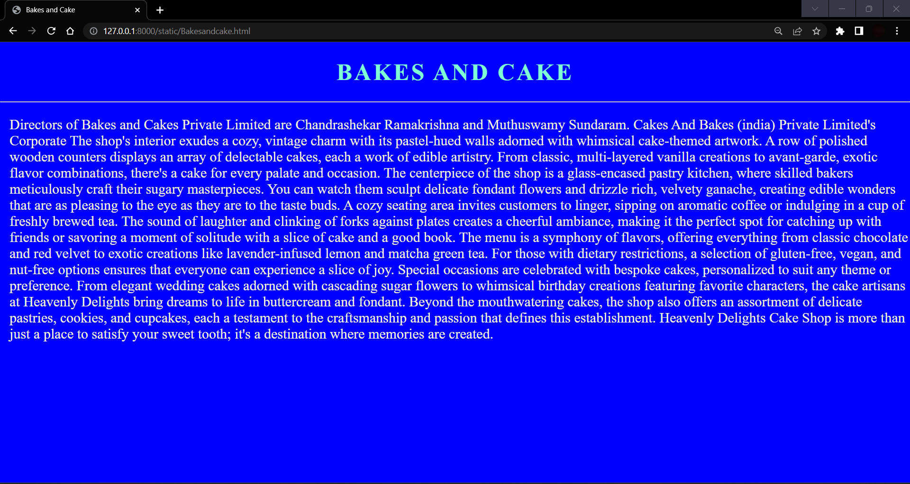
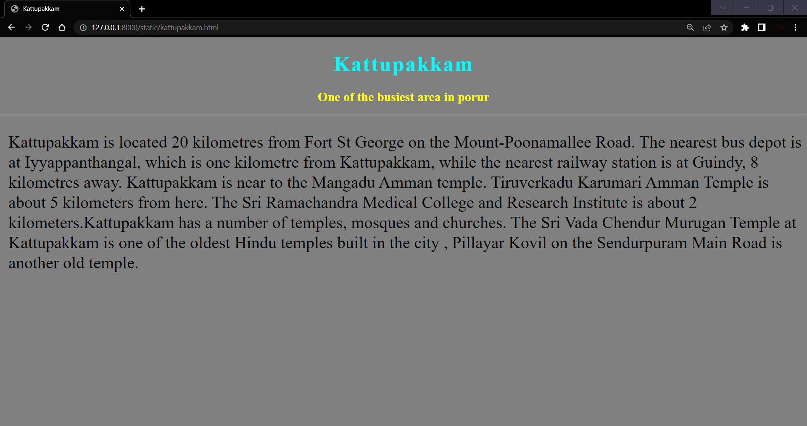
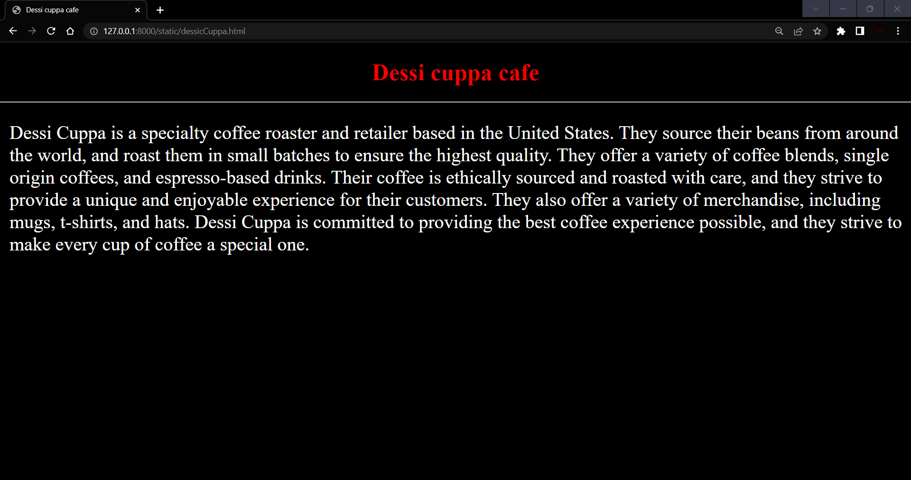
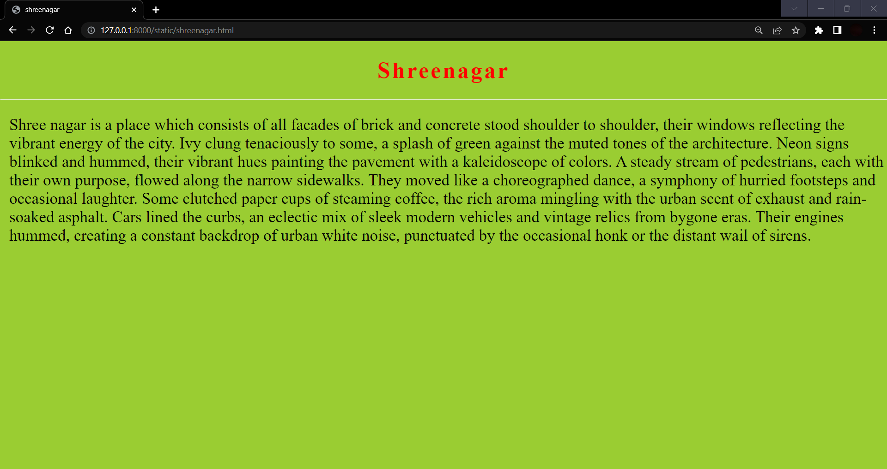
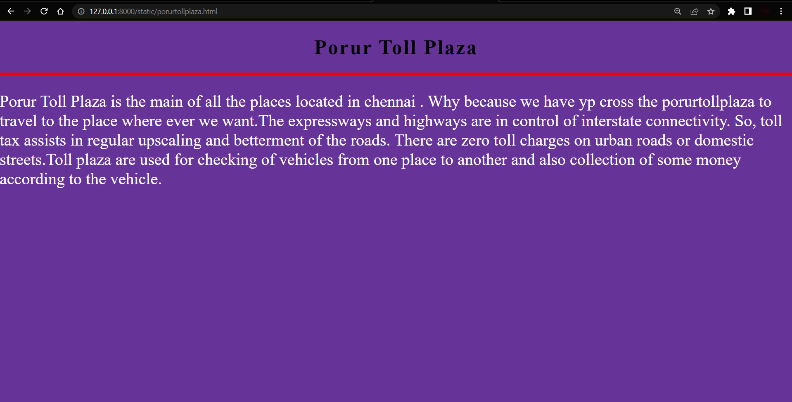

# Ex04 Places Around Me
## AIM
To develop a website to display details about the places around my house.

## DESIGN STEPS

### STEP 1
Create a Django admin interface.

### STEP 2
Download your city map from Google.

### STEP 3
Using ```<map>``` tag name the map.

### STEP 4
Create clickable regions in the image using ```<area>``` tag.

### STEP 5
Write HTML programs for all the regions identified.

### STEP 6
Execute the programs and publish them.

## CODE

```
Porur.map

<!DOCTYPE html>
<html lang="en">
<head>
    <meta charset="UTF-8">
    <meta name="viewport" content="width=device-width, initial-scale=1.0">
    <title>Porur Map</title>

    <style>
        body {
            margin: 0;
            padding: 0;
            overflow-y: hidden;
        }

        h1 {
            font-size: 50px;
            color: black;
            display: flex;
            justify-content: center;
            font-family: 'poppins' , sans-serif;
        }

        h2 {

            color: black;
            font-size: 30px;
            letter-spacing: 3px;
            text-align: center;
            margin-bottom: 5px;
        }

        hr {
            border: 2px solid black;
        }
    </style>
</head>
<body>

    <h1>
        MITHUN RAJ (212222040100)
    </h1>

    <h2>OUTLINE OF PORUR</h2>

    <hr>

    
    <map name="Porur">
        <area target="_blank" alt="Dessi Cuppa Porur" title="Dessi Cuppa" href="dessicCuppa.html" coords="1022,471,21" shape="circle">
        <area target="_blank" alt="KATTUPAKKAM" title="KATTUPAKKAM" href="kattupakkam.html" coords="383,294,22" shape="circle">
        <area target="_blank" alt="SHREE NAGAR" title="SHREE NAGAR" href="shreenagar.html" coords="556,545,625,594" shape="circle">
        <area target="_blank" alt="Bakes and cake" title="Bakes and cake" href="Bakesandcake.html" coords="1113,289,1158,334" shape="circle">
        <area target="_blank" alt="Porur toll plaza" title="Porur toll plaza" href="porurtollplaza.html" coords="1068,237,1118,275" shape="circle">
    </map>
</body>
</html>

Kattupakkam.html

<!DOCTYPE html>
<html lang="en">
<head>
    <meta charset="UTF-8">
    <meta name="viewport" content="width=device-width, initial-scale=1.0">
    <title>Kattupakkam</title>

    <style>
        body {
            margin: 0;
            padding: 0;
            background-color: grey;
        }
        h1 {
            color: aqua;
            font-size: 50px;
            text-align: center;
            letter-spacing: 3px;
        }

        h2 {
            color: yellow;
            font-size: 30px;
            text-align: center;
        }
        p {
            color: black;
            font-size: 40px;
            line-height: 3rem;
            margin-left: 20px;

        }
    </style>
</head>
<body>
    <h1>Kattupakkam</h1>
    <h2>One of the busiest area in porur</h2>
    <hr>

    <p>Kattupakkam is located 20 kilometres from Fort St George on the Mount-Poonamallee Road. The nearest bus depot is at Iyyappanthangal, which is one kilometre from Kattupakkam, while the nearest railway station is at Guindy, 8 kilometres away. Kattupakkam is near to the Mangadu Amman temple. Tiruverkadu Karumari Amman Temple is about 5 kilometers from here. The Sri Ramachandra Medical College and Research Institute is about 2 kilometers.Kattupakkam has a number of temples, mosques and churches. The Sri Vada Chendur Murugan Temple at Kattupakkam is one of the oldest Hindu temples built in the city , Pillayar Kovil on the Sendurpuram Main Road is another old temple.</p>
    
</body>
</html>

Dessicuppa.html

<!DOCTYPE html>
<html lang="en">
<head>
    <meta charset="UTF-8">
    <meta name="viewport" content="width=device-width, initial-scale=1.0">
    <title>Dessi cuppa cafe</title>

    <style>
        body {

            margin: 0;
            padding: 0;
            background-color: black;
        }

        h1 {
            text-align: center;
            color: red;
            font-size: 50px;
        }

        p {

        color: white;
        font-size: 40px;
        margin-left: 20px;
        }
    
    </style>
</head>
<body>
    <h1>Dessi cuppa cafe</h1>
    <hr>
    <p>Dessi Cuppa is a specialty coffee roaster and retailer based in the United States. They source their beans from around the world, and roast them in small batches to ensure the highest quality. They offer a variety of coffee blends, single origin coffees, and espresso-based drinks. Their coffee is ethically sourced and roasted with care, and they strive to provide a unique and enjoyable experience for their customers. They also offer a variety of merchandise, including mugs, t-shirts, and hats. Dessi Cuppa is committed to providing the best coffee experience possible, and they strive to make every cup of coffee a special one.</p>
    
</body>
</html>

bakesandcake.html

<!DOCTYPE html>
<html lang="en">
<head>
  <meta charset="UTF-8">
  <meta name="viewport" content="width=device-width, initial-scale=1.0">
  <title>Bakes and Cake</title>

  <style>
    body {
      margin: 0;
      padding: 0;
      background-color: blue;
      overflow-y: hidden;
    }

    h1 {
      font-size: 50px;
      color: aquamarine;
      text-align: center;
      letter-spacing: 4px;
    }

    p {
      font-size: 30px;
      color: beige;
      margin-left: 20px;

    }
  </style>
</head>
<body>

  <h1>BAKES AND CAKE</h1>

  <hr>

  <p>Directors of <span>Bakes and Cakes</span> Private Limited are Chandrashekar Ramakrishna and Muthuswamy Sundaram. Cakes And Bakes (india) Private Limited's Corporate
    The shop's interior exudes a cozy, vintage charm with its pastel-hued walls adorned with whimsical cake-themed artwork. A row of polished wooden counters displays an array of delectable cakes, each a work of edible artistry. From classic, multi-layered vanilla creations to avant-garde, exotic flavor combinations, there's a cake for every palate and occasion.
    The centerpiece of the shop is a glass-encased pastry kitchen, where skilled bakers meticulously craft their sugary masterpieces. You can watch them sculpt delicate fondant flowers and drizzle rich, velvety ganache, creating edible wonders that are as pleasing to the eye as they are to the taste buds.

    A cozy seating area invites customers to linger, sipping on aromatic coffee or indulging in a cup of freshly brewed tea. The sound of laughter and clinking of forks against plates creates a cheerful ambiance, making it the perfect spot for catching up with friends or savoring a moment of solitude with a slice of cake and a good book.
    
    The menu is a symphony of flavors, offering everything from classic chocolate and red velvet to exotic creations like lavender-infused lemon and matcha green tea. For those with dietary restrictions, a selection of gluten-free, vegan, and nut-free options ensures that everyone can experience a slice of joy.
    Special occasions are celebrated with bespoke cakes, personalized to suit any theme or preference. From elegant wedding cakes adorned with cascading sugar flowers to whimsical birthday creations featuring favorite characters, the cake artisans at Heavenly Delights bring dreams to life in buttercream and fondant.

    Beyond the mouthwatering cakes, the shop also offers an assortment of delicate pastries, cookies, and cupcakes, each a testament to the craftsmanship and passion that defines this establishment.
    
    Heavenly Delights Cake Shop is more than just a place to satisfy your sweet tooth; it's a destination where memories are created.


</p>
  
</body>
</html>

porurtollplaza.html

<!DOCTYPE html>
<html lang="en">
<head>
  <meta charset="UTF-8">
  <meta name="viewport" content="width=device-width, initial-scale=1.0">
  <title>Porur toll plaza</title>

  <style>
    body {
      margin: 0;
      padding: 0;
      background-color: rebeccapurple;
    }

  h1 {
    font-size: 50px;
    font-weight: 600;
    text-align: center;
    letter-spacing: 3px;
    color: black;
  }
  p {
    font-size: 40px;
    color: white;

  }

  hr {
    border: 3px solid red;
  }
  </style>
</head>
<body>
  
  <h1>Porur Toll Plaza</h1>
  <hr>
  
  <p>Porur Toll Plaza is the main of all the places located in chennai . Why because we have yp cross the porurtollplaza to travel to the place where ever we want.The expressways and highways are in control of interstate connectivity. So, toll tax assists in regular upscaling and betterment of the roads. There are zero toll charges on urban roads or domestic streets.Toll plaza are used for checking of vehicles from one place to another and also collection of some money according to the vehicle.</p>
</body>
</html>


```

## OUTPUT






## HTML VALIDATOR


## RESULT
The program for implementing image maps using HTML is executed successfully.
